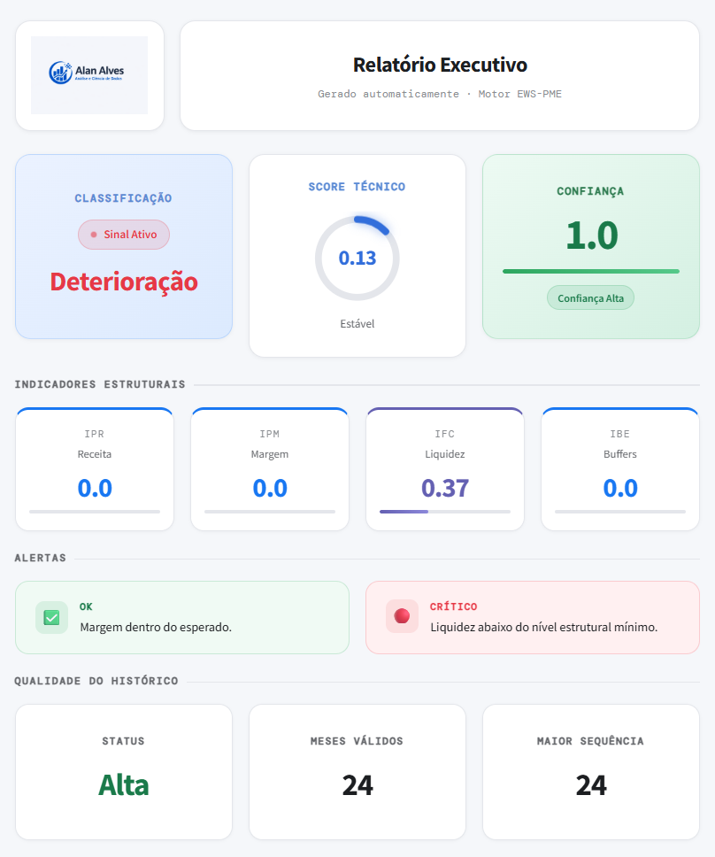

# Motor de Deterioração de Negócios (Business Deterioration Engine)

Sistema de alerta precoce (Early Warning System) para identificar sinais de deterioração estrutural em pequenas e médias empresas (PMEs) a partir da análise de receita, custos e caixa.

O projeto implementa um motor analítico baseado em regras estatísticas interpretáveis, capaz de detectar padrões persistentes de desempenho financeiro negativo.

O objetivo não é prever falências, mas identificar regimes de deterioração estrutural antes que a situação se torne crítica.

## Demo Online

[sistemadeterioracao.streamlit.app](https://sistemadeterioracao.streamlit.app/)

## Prints do Dashboard



## Como Rodar Localmente

```bash
pip install -r requirements.txt
streamlit run app.py
```

## Problema

Negócios raramente entram em crise de forma súbita.  
Na maioria dos casos, a deterioração ocorre de forma progressiva e persistente, manifestando-se em padrões como:

- Margens negativas recorrentes
- Redução gradual da rentabilidade
- Sequências prolongadas de desempenho abaixo do esperado

Ferramentas tradicionais de análise financeira costumam focar em indicadores pontuais, o que dificulta a identificação desses padrões estruturais.

Este projeto propõe um motor analítico capaz de detectar regimes persistentes de deterioração.

## Abordagem do Modelo

O sistema parte de uma hipótese simples:

> A deterioração de um negócio não é definida por um mês negativo, mas pela persistência de desempenho abaixo do nível estrutural esperado.

Para capturar esse fenômeno, o motor avalia três dimensões principais:

- **Persistência**: frequência com que os indicadores ficam abaixo do nível estrutural.
- **Sequência**: duração de períodos consecutivos de baixo desempenho.
- **Intensidade**: profundidade da compressão financeira.

As métricas são derivadas de **receita, custos e caixa**, com cálculo de **margem** (receita - custos).

## Indicadores do Sistema

### IPR — Indicador de Persistência da Receita

Mede a persistência da receita abaixo do baseline histórico.

### IPM — Indicador de Persistência da Margem

Mede a persistência da margem operacional abaixo do baseline e penaliza quando a margem média recente é negativa.

### IFC — Indicador de Fragilidade de Caixa (Liquidez)

Combina tendência negativa do caixa com a cobertura de custos em meses.  
Quando a cobertura fica abaixo do mínimo estrutural, ativa a regra de liquidez crítica.

### IBE — Indicador de Erosão de Buffers

Mede a erosão do caixa em relação ao baseline e a persistência abaixo da mediana.

### ISG — Indicador de Saúde Geral

Calcula um score técnico ponderado e gera a classificação executiva.  
Thresholds atuais:

| Intervalo do score | Classificação |
| --- | --- |
| 0.00 a 0.30 | Saudável |
| 0.31 a 0.55 | Atenção |
| 0.56 a 0.75 | Enfraquecimento |
| 0.76 a 1.00 | Deterioração |

## Arquitetura do Sistema (atual)

```
EWS_ML/
├── app.py
├── pages/
│   ├── 1_Análise.py
│   └── 2_Relatório.py
│   └── 3_Indicadores.py
├── core/
│   ├── __init__.py
│   ├── baseline.py
│   ├── confianca.py
│   ├── ibe.py
│   ├── ifc.py
│   ├── ipm.py
│   ├── ipr.py
│   ├── isg.py
│   ├── pdf_report.py
│   ├── report.py
│   └── utils.py
├── assets/
│   ├── logo.png
│   └── logo_banner.png
│   └── prints/
│       └── dashboard_01.png
├── .streamlit/
│   └── config.toml
├── charts/
│   ├── __init__.py
│   ├── caixa_custos.py
│   ├── ifc.py
│   ├── ibe.py
│   ├── ipm.py
│   ├── ipr.py
│   └── margem_receita.py
├── config.py
├── main.py
└── requirements.txt
```

## Módulos principais (core)

- `baseline.py`: cálculo de baselines e validação de histórico mínimo.
- `confianca.py`: cálculo do score e status de confiança do histórico.
- `ipr.py`, `ipm.py`, `ifc.py`, `ibe.py`: implementação dos indicadores principais.
- `isg.py`: agregação dos indicadores e classificação final.
- `report.py`: consolidação do payload para o dashboard.
- `pdf_report.py`: geração do relatório em PDF (executivo + técnico).
- `utils.py`: funções auxiliares e formatação.

## Dados de Entrada

O motor utiliza uma série temporal mensal com estas colunas:

- `data` (YYYY-MM)
- `receita`
- `custos`
- `caixa`

Exemplo de dataset:

| data | receita | custos | caixa |
| --- | --- | --- | --- |
| 2023-01 | 100000 | 82000 | 50000 |
| 2023-02 | 102000 | 83000 | 53000 |
| 2023-03 | 101000 | 82500 | 56000 |

Requisito mínimo:

- 12 meses de histórico

Quanto maior o histórico disponível, maior a confiabilidade da análise.

## Saída do Sistema

O sistema gera:

- Dashboard com classificação, score técnico, confiança, indicadores e alertas.
- Relatório em PDF com seção executiva e detalhamento técnico.

## Filosofia do Projeto

O motor foi desenvolvido com três princípios principais:

- **Interpretabilidade**: indicadores transparentes e explicáveis.
- **Detecção estrutural**: foco em padrões persistentes, não oscilações de curto prazo.
- **Aplicação prática**: diagnóstico técnico de PMEs.

## Possíveis Aplicações

- Diagnóstico financeiro de empresas
- Consultoria empresarial
- Análise prévia de risco de crédito
- Monitoramento de desempenho de negócios
- Dashboards de acompanhamento financeiro

## Melhorias Futuras

- Classificação automática usando modelos estatísticos
- Criação de score de risco empresarial
- Integração com dashboards interativos
- Análise de sobrevivência de empresas
- Comparação setorial

## Autor

Alan Alves
galves.alan@gmail.com

Projeto desenvolvido como estudo aplicado em análise de deterioração de negócios e sistemas de alerta precoce.
